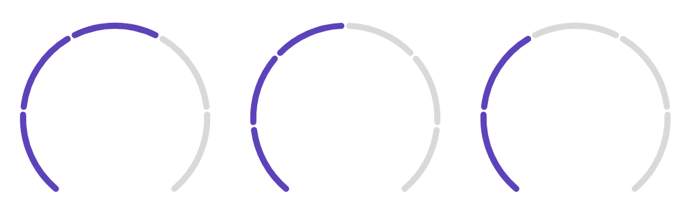

# SVGRady ◠

[](https://badge.fury.io/js/svgrady)
[](https://travis-ci.com/Fecony/svgrady)
[](https://codecov.io/gh/Fecony/svgrady)

### Javascript Separated Radial SVG generator



## Installation

You can install SVGRady as an NPM package:

```bash
npm install svgrady
```

Or link directly to the CDN:

```html
<script src="https://unpkg.com/svgrady@latest/dist/svgrady.umd.js"></script>
```

## Usage

Import package

```js
import svgrady from 'svgrady'
```

In your layout add data attribute with values (min,max).
Where 3 is minimal(completed steps), and 5 is total count, separated by comma.

> Note: you will need to use data attribute to initialize svgrady

```html
<div data-svgrady="3,5"></div>
```

Customize options and initialize SVGRady

> **Note**: Polar axis is rotated by 90° and is located on top

> Look at [Configuration](#configuration) for possible options

```js
let options = {}

new SVGRady(options)
```

## Configuration

Options that can be passed:

- `selector` - add svgrady to elements with data-`selector` (default `svgrady`)
- `width` - SVG width 150 (default `150`)
- `height` - SVG height (default `150`)
- `radius` - SVG radial radius (default `60`)
- `start` - Start angle (default `-140`)
- `end` - End Angle (default `140`)
- `spacing` - Spacing between each step (default `5`)
- `activeColor` - Active(Completed) step color (default `#613DC1`)
- `color` - Default color for step (default `#D9DAD8`)
- `replace` - if true, will replace element with svg (default `false`)
- `strokeWidth` - SVG stroke width, will be used to calculate distance between each step (default `4`)
- `linecap` - SVG stroke linecap e.g.:( `round` | `butt` | `square`) (default `round`)
- `className` - Class name that will be added to svg

## To Do:

Things that can be implemented.

- Animations
- Tooltips (show info about step)
- Flex grow on elements?
- Pass multiple options?
- ...

## Contributing

Pull requests are welcome. For major changes, please open an issue first to discuss what you would like to change.

Please make sure to update tests as appropriate.

## License

[MIT](https://choosealicense.com/licenses/mit/)
